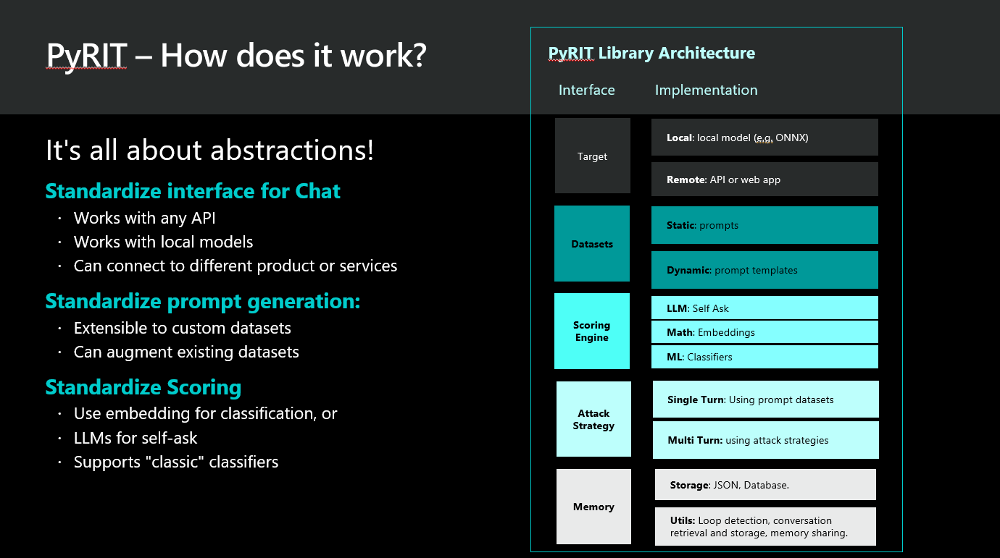

# About PyRIT

The Python Risk Identification Tool for generative AI (PyRIT) is an open access automation framework to empower security professionals and ML engineers to red team foundation models and their applications.

## Architecture

The PyRIT framework architecture is designed to evaluate the robustness of Large Language Models (LLMs). The framework is composed of several key components, each serving a distinct purpose.

* **Target**: The "Target Component" represents the Large Language Model (LLM) and can be configured in distinct roles such as an attacker, target, or scorer.
It accommodates both local models, like ONNX, and models hosted on platforms such as Hugging Face, as well as models deployed in Azure Machine Learning (AML) managed online endpoint and Azure OpenAI (AOAI) service.
The attacker LLM, also referred to as the red teaming bot, generates challenging prompts or scenarios to test the target LLM for any vulnerabilities. In addition, the scorer LLM evaluates the input according to the system instructions provided.

* **Datasets**: The "Datasets Component" offers an array of prompts. It includes prompt templates and static prompts. The prompt templates might include various jailbreaking scenarios, while the static prompts can range from benign to harmful. These templates and prompts are combined and then sent to the target bot for testing.

* **Scoring Engine**: The "Scoring Engine" assesses the responses produced by the target LLM during probing sessions, utilizing techniques such as self-ask for evaluation.

* **Attack Strategy**: The "Attack Strategy" component outlines the attack methodologies for probing the target LLM. It supports single-turn and multi-turn attacks.
In a single-turn scenario, a prompt is submitted to the target LLM system, and its response is observed and evaluated once. Conversely, in multi-turn scenarios, a red teaming bot persistently engages the target, submitting a series of prompts until a specific objective is met, involving multiple interactions.

* **Memory**: The "Memory Component" is designed to persist all the conversations that occur while probing the target LLM. It allows the analysis of repeated conversations, helps in finding any conversation, and sharing with others.

## PyRIT and AI Red Teaming

Below is a high-level overview of how PyRIT can help in AI Red Teaming operations.
It starts with the red teaming bot sending a prompt to the application's API endpoint.
From there, the prompt passes through a variety of classifiers that may influence what happens to the prompt (e.g., content moderation, forwarding to different models).
Finally, a LLM responds.
The red teaming bot then proceeds to pass the response to the scoring engine.
This could include sending the response to a scoring endpoint, manual scoring (by a human), or scoring using a local model.
The result is passed back to the red teaming bot to inform the next iteration of generating prompts.

## Methodology

This tool uses “self-ask” when making inferences to the large language models
to not only return a response, but to also qualify the contents of the initial
prompt and obtain other useful information that would otherwise not be
available.

Here's an example of "self-ask" prompting:

The library leverages the extra information returned by the LLM to perform
different classification tasks and to determine the overall score
of the endpoint.

Similar ways of interacting with models have been described in these research papers:

* [_On Faithfulness and Factuality in Abstractive Summarization_](https://arxiv.org/pdf/2005.00661v1.pdf)
* [_Chain-of-Thought Prompting Elicits Reasoning in Large Language Models_](https://arxiv.org/pdf/2201.11903v6.pdf)
