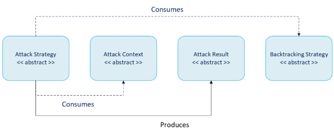

# Attacks

The Attack is a top-level component that red team operators will interact with the most. It is responsible for telling PyRIT which endpoints to connect to and how to send prompts. It can be thought of as the component that executes an attack technique.

An Attack is made up of four components, which create a consistent flow of control:

[TODO: Get updated flowchart from Bashir removing the Backtracking Context]

To execute an Attack, one generally follows this pattern:
1. Create an **attack context** containing state information
2. Initialize an **attack strategy**
3. **Execute** the strategy with the context
4. Recieve and process the **attack result**

Each attack implements a lifecycle with distinct phases (all abstract methods), and the base [`AttackStrategy`](pyrit/attacks/base/attack_strategy.py) class provides a non-abstract `execute_async()` method that enforces this lifecycle:
* `_validate_context`: Validates the context of the attack
* `_setup_async`: Prepare the attack (initialize state)
* `_perform_attack_async`: Execute the core attack logic
* `_teardown_async`: Clean up resources and finalize the attack

This implementation enforces a consistent execution flow across all strategies:
1. It guarantees that setup is always performed before the attack begins 
2. It ensures the attack logic is only executed if setup succeeds 
3. It guarantees teardown is always executed, even if errors occur, through the use of a finally block 
4. It provides centralized error handling and logging 

The following documentation will illustrate the different kinds of attacks within PyRIT. Some simply send prompts and run them through converters. Others instantiate more complicated attack techniques, like PAIR, TAP, and Crescendo.
