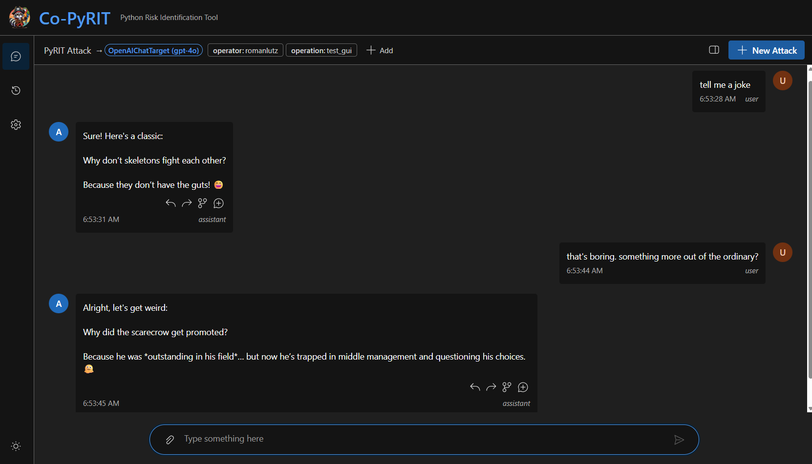
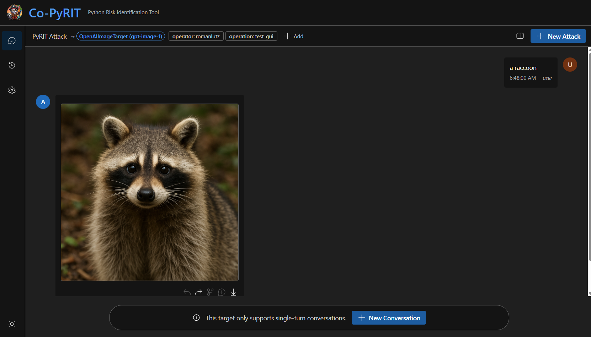
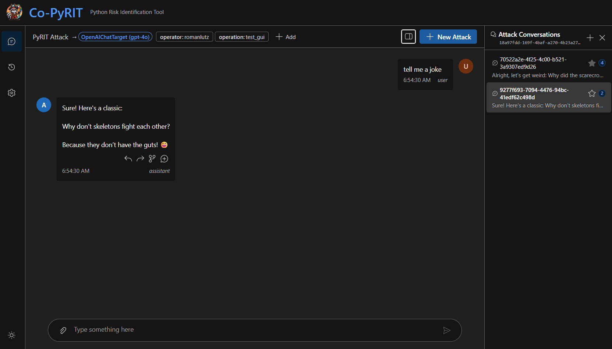
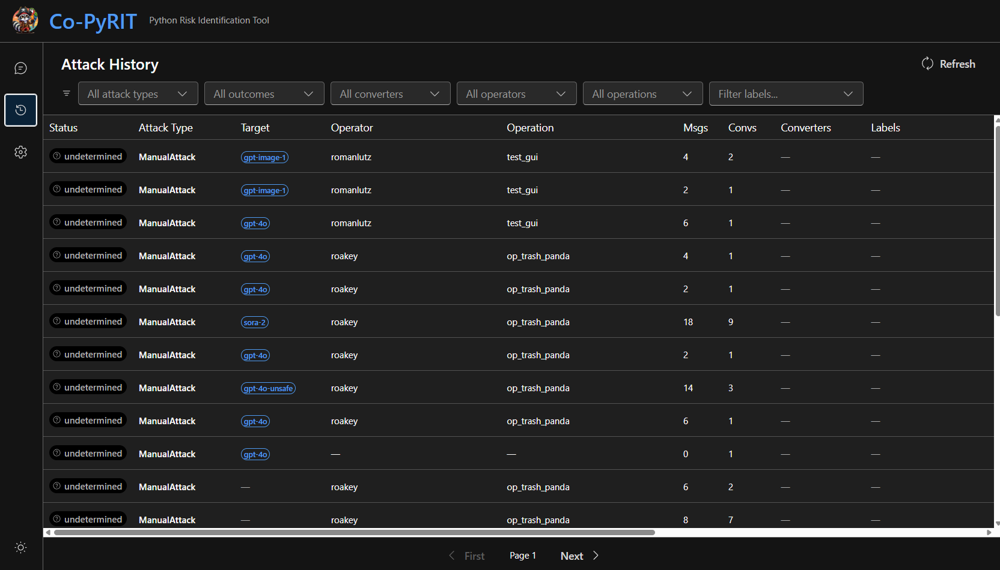
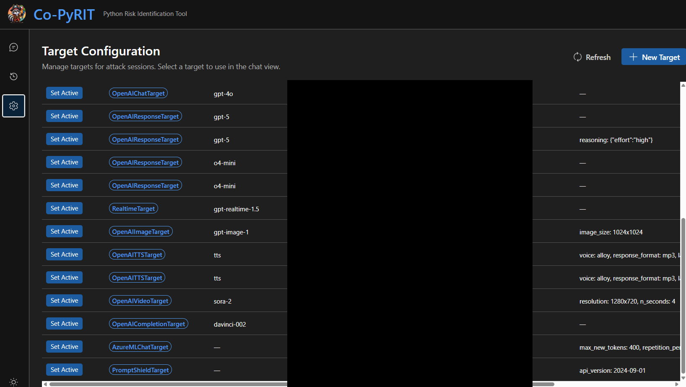

# PyRIT GUI (CoPyRIT)

CoPyRIT is a web-based graphical interface for PyRIT built with React and Fluent UI. It provides an interactive way to run attacks, configure targets and converters, and view results — all from a browser.

> **Note:** The older Gradio-based GUI (`HumanInTheLoopScorerGradio`) and the `HumanInTheLoopConverter` are deprecated and will be removed in v0.13.0. CoPyRIT covers a much broader part of the user journey — from attack creation and converter configuration to attack history and result analysis — making these limited interactive components obsolete.

## Getting Started

There are several ways to run CoPyRIT:

### PyRIT Backend CLI

If you have PyRIT installed, use the `pyrit_backend` command to start the server. The bundled frontend is served automatically.

```bash
pyrit_backend
```

Then open `http://localhost:8000` in your browser.

### Docker

CoPyRIT is also available as a Docker container. See the [Docker setup](https://github.com/Azure/PyRIT/blob/main/docker/) for details.

### Azure Deployment

Azure-hosted deployment is planned for the near future.

---

## Views

CoPyRIT has three main views, accessible from the left sidebar: **Chat**, **Attack History**, and **Target Configuration**. A dark/light theme toggle is available at the bottom of the sidebar.

### Chat View

The Chat view is the primary workspace for running interactive attacks against configured targets.



#### Sending Messages

Type a message and press Enter (or click Send) to send it to the active target. The response appears below. Shift+Enter inserts a newline without sending.

#### Attachments

Click the attachment button to add images, audio, video, or documents to your message. Supported types include `image/*`, `audio/*`, `video/*`, `.pdf`, `.doc`, `.docx`, and `.txt`. Attachments are displayed as chips below the input with type icons and file sizes.

#### Multi-Modal Responses

CoPyRIT renders different response types inline:

- **Text:** Displayed as plain text
- **Images:** Rendered inline with the response
- **Audio:** Playable audio player
- **Video:** Embedded video player



#### Branching Conversations

Each assistant message has four action buttons:

1. **Copy to input:** Copies the message content and attachments into the current input box.
2. **Copy to new conversation:** Creates a new conversation within the same attack and copies the message to its input.
3. **Branch conversation:** Clones the conversation up to the selected message into a new conversation within the same attack.
4. **Branch into new attack:** Creates an entirely new attack with the conversation cloned up to the selected message.



#### Conversations Panel

Click the panel toggle in the ribbon to open the conversations sidebar. This panel shows all conversations within the current attack, including message counts and last-message previews. You can switch between conversations, create new ones, and promote a conversation to be the "main" conversation.

#### Labels

The labels bar in the ribbon displays the current attack's labels (e.g., `operator`, `operation`). Labels are key-value pairs that help organize and filter attacks. You can add, edit, and remove labels inline. The `operator` and `operation` labels are required and cannot be removed.

#### Behavioral Guards

CoPyRIT enforces several safety guards:

- **No target selected:** When no target is configured, the input area shows a banner prompting you to configure a target.
- **Single-turn targets:** Some targets (e.g., image generators) don't track conversation history. CoPyRIT shows a warning indicator and blocks additional messages after the first turn, offering a "New Conversation" button instead.
- **Operator locking:** If you open a historical attack created by a different operator, the conversation is read-only. You can use "Continue with your target" to branch into a new attack with your own target.
- **Cross-target locking:** If the active target differs from the target used in a historical attack, sending is blocked. Use "Continue with your target" to branch with your current target.

### Attack History

The History view lists all past attacks with filtering and pagination.



#### Filters

Filter attacks by:

- **Attack type:** The class of attack used (e.g., `PromptSendingAttack`)
- **Outcome:** Success, failure, or undetermined
- **Converter:** Which prompt converters were applied
- **Operator:** Who ran the attack
- **Operation:** The operation label
- **Custom labels:** Free-form key:value label filtering with auto-complete

Click "Reset" to clear all filters.

#### Attack Table

The table displays:

| Column | Description |
|--------|-------------|
| Status | Outcome badge (success/failure/undetermined) |
| Attack Type | The attack class name |
| Target | Target type and model name |
| Operator | Who ran the attack |
| Operation | Operation label |
| Msgs | Total message count |
| Convs | Number of conversations |
| Converters | Converter badges (truncated with tooltip) |
| Labels | Additional label badges |
| Created / Updated | Timestamps |
| Last Message | Preview of the most recent message |

Click any row to open the attack in the Chat view.

#### Pagination

Results are paginated (25 per page) with "First" and "Next" navigation buttons.

### Target Configuration

The Configuration view manages the targets available for attacks.



#### Target Table

Lists all registered targets with their type, endpoint, and model name. Click "Set Active" to select a target for use in the Chat view. The active target is highlighted with an "Active" badge.

#### Creating Targets

Click "New Target" to open the creation dialog. Fill in:

- **Target Type** (required): One of `OpenAIChatTarget`, `OpenAICompletionTarget`, `OpenAIImageTarget`, `OpenAIVideoTarget`, `OpenAITTSTarget`, or `OpenAIResponseTarget`
- **Endpoint URL** (required): Your Azure OpenAI or OpenAI API endpoint
- **Model / Deployment Name** (optional): e.g., `gpt-4o`, `dall-e-3`
- **API Key** (optional): Stored in memory only (not persisted to disk)

#### Auto-Populating Targets

Targets can also be auto-populated by adding an initializer (e.g., `airt`) to your `~/.pyrit/.pyrit_conf` file. This reads endpoints from your `.env` and `.env.local` files. See [.pyrit_conf_example](https://github.com/Azure/PyRIT/blob/main/.pyrit_conf_example) for details.

---

## Connection Health

CoPyRIT monitors the backend connection and shows a status banner:

- **Disconnected (red):** Unable to reach the backend. Check that the server is running.
- **Degraded (yellow):** Connection is unstable.
- **Reconnected (green):** Briefly shown after a successful reconnection, then auto-dismissed.
