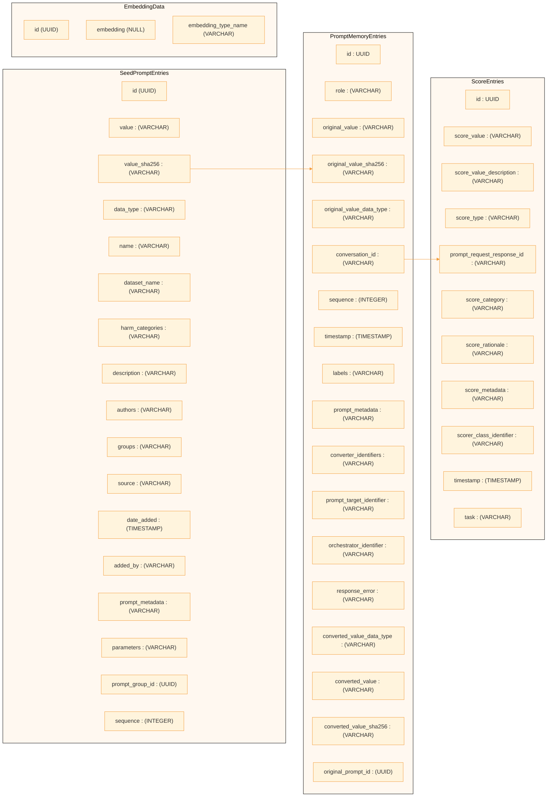

``` {note}
This is a mapping of the database schema and shows how our databases map together!
```


```mermaid
%%{
  init: {
    'theme': 'base',
    'themeVariables': {
      'lineColor': '#f39e3d',
      'secondaryColor': '#f6bb77',
      'primaryBorderColor': '#f39e3d',
      'clusterBorder': '#000000',
      'clusterBkg': '#fff8f0'
    }
  }
}%%
graph LR
    subgraph SeedPromptEntries
        S_id["id (UUID)"]
        S_value["value : (VARCHAR)"]
        S_value_sha256["value_sha256 : (VARCHAR)"]
        S_data_type["data_type : (VARCHAR)"]
        S_name["name : (VARCHAR)"]
        S_dataset_name["dataset_name : (VARCHAR)"]
        S_harm_categories["harm_categories : (VARCHAR)"]
        S_description["description : (VARCHAR)"]
        S_authors["authors : (VARCHAR)"]
        S_groups["groups : (VARCHAR)"]
        S_source["source : (VARCHAR)"]
        S_date_added["date_added : (TIMESTAMP)"]
        S_added_by["added_by : (VARCHAR)"]
        S_prompt_metadata["prompt_metadata : (VARCHAR)"]
        S_parameters["parameters : (VARCHAR)"]
        S_prompt_group_id["prompt_group_id : (UUID)"]
        S_sequence["sequence : (INTEGER)"]
    end

    subgraph PromptMemoryEntries
        P_id["id : UUID"]
        P_role["role : (VARCHAR)"]
        P_original_value["original_value : (VARCHAR)"]
        P_original_value_sha256["original_value_sha256 : (VARCHAR)"]
        P_original_value_data_type["original_value_data_type : (VARCHAR)"]
        P_conversation_id["conversation_id : (VARCHAR)"]
        P_sequence["sequence : (INTEGER)"]
        P_timestamp["timestamp : (TIMESTAMP)"]
        P_labels["labels : (VARCHAR)"]
        P_prompt_metadata["prompt_metadata : (VARCHAR)"]
        P_converter_identifiers["converter_identifiers : (VARCHAR)"]
        P_prompt_target_identifier["prompt_target_identifier : (VARCHAR)"]
        P_orchestrator_identifier["orchestrator_identifier : (VARCHAR)"]
        P_response_error["response_error : (VARCHAR)"]
        P_converted_value_data_type["converted_value_data_type : (VARCHAR)"]
        P_converted_value["converted_value : (VARCHAR)"]
        P_converted_value_sha256["converted_value_sha256 : (VARCHAR)"]
        P_original_prompt_id["original_prompt_id : (UUID)"]
    end

    subgraph ScoreEntries
        Sc_id["id : UUID"]
        Sc_score_value["score_value : (VARCHAR)"]
        Sc_score_value_description["score_value_description : (VARCHAR)"]
        Sc_score_type["score_type : (VARCHAR)"]
        Sc_prompt_request_response_id["prompt_request_response_id  : (VARCHAR)"]
        Sc_score_category["score_category : (VARCHAR)"]
        Sc_score_rationale["score_rationale : (VARCHAR)"]
        Sc_score_metadata["score_metadata : (VARCHAR)"]
        Sc_scorer_class_identifier["scorer_class_identifier : (VARCHAR)"]
        Sc_timestamp["timestamp : (TIMESTAMP)"]
        Sc_task["task : (VARCHAR)"]
    end
    
    subgraph EmbeddingData
        E_id["id (UUID)"]
        E_embedding["embedding (NULL)"]
        E_embedding_type_name["embedding_type_name (VARCHAR)"]
    end

    %% Relationship arrow
    S_value_sha256 -->P_original_value_sha256
    P_conversation_id -->Sc_prompt_request_response_id

    %% Apply table style
    class S_id,S_value,S_value_sha256,S_data_type,S_name,S_dataset_name,S_harm_categories,S_description,S_authors,S_groups,S_source,S_date_added,S_added_by,S_prompt_metadata,S_parameters,S_prompt_group_id,S_sequence tableStyle;
    class P_id,P_role,P_original_value,P_original_value_sha256,P_original_value_data_type,P_conversation_id,P_sequence,P_timestamp,P_labels,P_prompt_metadata,P_converter_identifiers,P_prompt_target_identifier,P_orchestrator_identifier,P_response_error,P_converted_value_data_type,P_converted_value,P_converted_value_sha256,P_original_prompt_id tableStyle;
    class Sc_id,Sc_score_value,Sc_score_value_description,Sc_score_type,Sc_prompt_request_response_id,Sc_score_category,Sc_score_rationale,Sc_score_metadata,Sc_scorer_class_identifier,Sc_timestamp,Sc_task tableStyle;
    class E_id,E_embedding,E_embedding_type_name tableStyle;
```