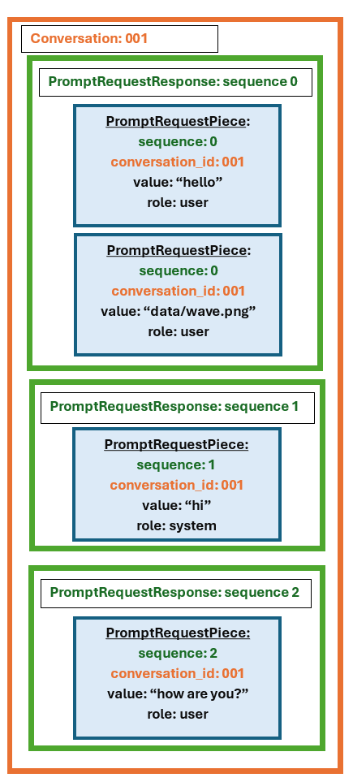

# 3. PromptRequestPiece and PromptRequestResponse

One of the most basic data structures is [PromptRequestPiece](../../../pyrit/models/prompt_request_piece.py) and [PromptRequestResponse](../../../pyrit/models/prompt_request_response.py).

`PromptRequestPiece` is a single piece of a request to a target. It has a `role` (e.g. user), a `type` (like text or image_path), a `value` (like "hello, how are you"), and various other fields. This is a unit that is stored in the database.

`PromptRequestResponse` can be thought of as a single request or response to a target. It can contain multiple `PromptRequestPieces`. E.g. if you send an image with text in a single request, one `PromptRequestResponse` is made up of two `PromptRequestPieces`.

Here is a sample conversation made up of three PromptRequestResponses which all share the same conversation ID. The sequence of the PromptRequestPieces and corresponding PromptRequestResponses dictates the order of the conversation. The first PromptRequestResponse in the image contains two parts--a text PromptRequestPiece and an image PromptRequestPiece.

This is plumbed all the way through PyRIT, and the flexibility allows us to interact with various modalities seamlessly.
