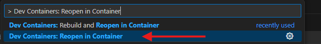

# DevContainers Setup in Visual Studio Code

DevContainers provide a pre-configured development environment for PyRIT that ensures consistency across all contributors. This is the recommended setup for contributors using Visual Studio Code.

```{note}
**Development Version:** This setup uses the **latest development code** from the main branch, not a stable release. The notebooks in your cloned repository will match your code version.
```

## Who Should Use DevContainers?

✅ **Use DevContainers if you:**
- Use Visual Studio Code as your editor. (Note that DevContainers can be used independently but our installation guide leverages VS Code since it's seamless.)
- Want a pre-configured development environment
- Want consistency with other contributors
- Prefer not to manage Python environments manually
- Need all development tools and extensions pre-installed

❌ **Consider [local installation](./1a_install_uv.md) if you:**
- Use a different IDE or editor
- Prefer full control over your development environment
- Need to customize your setup beyond what DevContainers offer

## Prerequisites

Before starting, install:

1. **Docker** (Docker Desktop if you are using Windows)
   - [Download Docker](https://docs.docker.com/get-docker/)

2. **Visual Studio Code**
   - [Download VS Code](https://code.visualstudio.com/Download)

3. **DevContainers Extension** in VS Code
   - [Install DevContainer Extension](https://marketplace.visualstudio.com/items?itemName=ms-vscode-remote.remote-containers)

You can also follow the **Installation** section on [Developing inside a Container](https://code.visualstudio.com/docs/devcontainers/containers) for more details.

## Setup Steps

### 1. Clone the PyRIT Repository

```bash
git clone https://github.com/Azure/PyRIT
cd PyRIT
```

### 2. Open in VS Code

Open the PyRIT folder in Visual Studio Code:

```bash
code .
```

### 3. Reopen in Container

Make sure Docker is running first, for example, by starting "Docker Desktop."

Press `Ctrl + Shift + P` (or `Cmd + Shift + P` on macOS) to open the VS Code Command Palette, then type and select:

```
Dev Containers: Reopen in Container
```



VS Code will:
1. Build the development container (this may take several minutes the first time)
2. Install all dependencies
3. Configure the development environment
4. Reopen VS Code inside the container

```{tip}
The first build takes longer as Docker downloads and configures everything. Subsequent opens will be much faster!
```

## Working with Jupyter Notebooks

### Selecting a Kernel

When working with Jupyter Notebooks (`.ipynb` files):

1. Open a notebook file in VS Code
2. Click the **"Select Kernel"** button in the top-right corner of the notebook
3. Choose **"Python Environments..."**
4. Select the **`pyrit-dev`** kernel

Alternatively, you can use the Command Palette:
- Press `Ctrl + Shift + P` (or `Cmd + Shift + P` on macOS)
- Type `>Notebook: Select Notebook Kernel`
- Choose **"Python Environments..."** > **`pyrit-dev`**

This kernel will run all code examples in Python Notebooks.

### Viewing Jupyter Variables

To view variables populated by code examples:

1. Go to **View** > **Output**
2. Select **Jupyter** from the dropdown menu

```{important}
**Note for Contributors:** When constructing a pull request, notebooks should not be edited directly. Instead, edit the corresponding `.py` file. See [Working with Notebooks](8_notebooks.md) for more details.
```

## Populating Secrets

After setting up your DevContainer, configure your API keys and secrets:

See [Populating Secrets](../setup/populating_secrets.md) for detailed instructions.

## Common DevContainer Operations

### Rebuild the Container

If you need to rebuild the container (e.g., after dependency changes):

1. Press `Ctrl + Shift + P` (or `Cmd + Shift + P` on macOS)
2. Type and select: `Dev Containers: Rebuild Container`

### Reopen Locally

To exit the container and return to your local environment:

1. Press `Ctrl + Shift + P` (or `Cmd + Shift + P` on macOS)
2. Type and select: `Dev Containers: Reopen Folder Locally`

## Troubleshooting

### Container Build Fails

**Problem**: DevContainer fails to build

**Solutions**:
1. Ensure Docker is running
2. Check that you have sufficient disk space
3. Try rebuilding: `Dev Containers: Rebuild Container Without Cache`

### Extension Not Loading

**Problem**: VS Code extensions don't load in the container

**Solution**: Check the `.devcontainer/devcontainer.json` file to ensure extensions are listed. Rebuild the container if needed.

### Performance Issues

**Problem**: Container runs slowly

**Solutions**:
1. Allocate more resources to Docker in Docker Desktop settings
2. On Windows, ensure you're using WSL 2 backend for better performance
3. Close unnecessary applications to free up system resources
